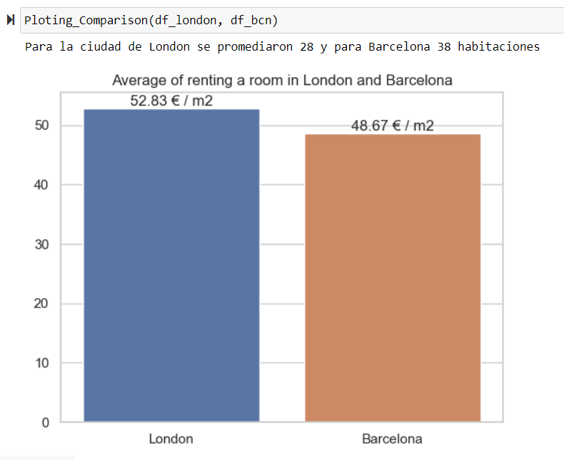

<!-- PROJECT LOGO -->

  
  

    An interesting assignment became a project of web scraping!
  

## About the Project

This is a Data Science Foundations course's assignment of the Master of Big Data and Artificial Intelligence Solutions

This repository will show the differences of prices/m^2 between shared rooms of London and Barcelona.

We use Python on Jupyter Notebooks for coding and Selenium for the Web Scraping

### Shared rooms in London:
To find shared rooms in London we looked for them on RightMove: https://www.rightmove.co.uk/

We can see in the picture below that the price and the size is marked with a red arrow, so these are the values we are gonna get with web scraping.

  

<!-- otra manera de poner link:  -->

### Shared rooms in Barcelona: 
To find shared rooms in Barcelona we looked for them on Badi: https://badi.com/es/

We can see in the picture below that the price and the size is marked with a red arrow, so these are values we are gonna get with web scraping.

<!-- otra manera de poner link:   -->

  

### Results:

I analize tens of pages and collected only the ones that had information (price and size of the bedroom).

Once we got the results of every city, we calculate the average of each city and compare each other as we see in the picture below.

<!-- otra manera de poner link:   -->

  

